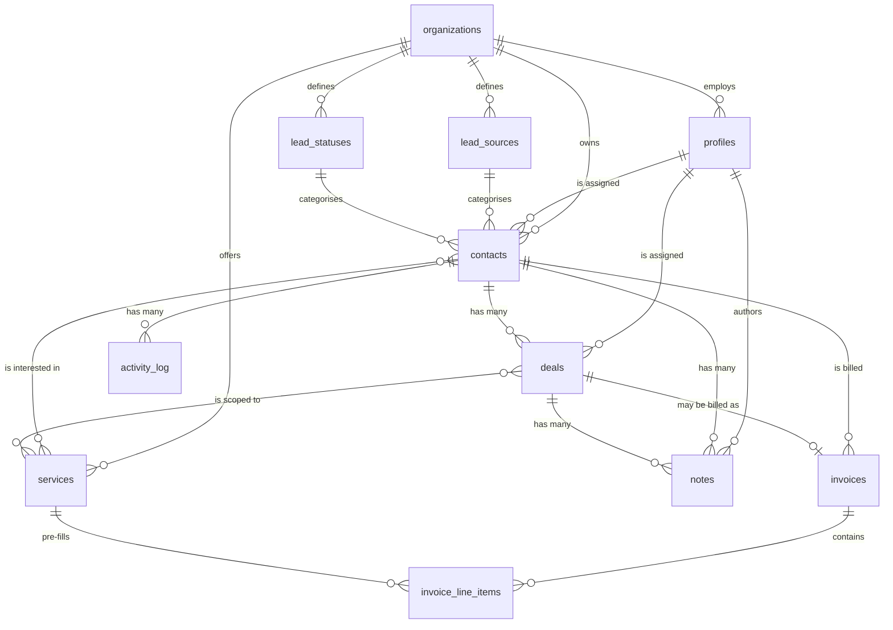

# Database Schema — Orbit Works CRM Phase 1

For client review, per the brief's note: *"Share the database schema with us
before you begin building so we can review and confirm the structure is
future-proof."*

This document explains **why** the schema looks the way it does. The
authoritative definitions live in `supabase/migrations/`.

---

## Design principles

1. **Every tenant-owned table carries `organization_id`.** Phase 1 runs a single
   organization, so this is invisible to users today. It exists now because a
   tenant boundary is the one thing that cannot be retrofitted — adding it later
   means rewriting every table, every query, and every security policy.
2. **User-editable vocabularies are lookup tables, never enums.** Settings lets
   admins rename lead sources and statuses; a Postgres enum would turn every
   rename into a schema migration.
3. **Derived state is computed, never stored.** "Overdue" is a function of the
   due date, so it is calculated on read and cannot drift.
4. **Financial records are immutable in the ways that matter.** Invoice line
   items snapshot their name and rate, so editing the service catalogue never
   rewrites history.
5. **Deactivate, don't delete.** Users, services, and lead sources are archived
   so historical authorship and references keep resolving.

---

## Entity relationships

---

## Tables

### `organizations`
The tenant root, and the home for all company-level settings: profile (name,
logo, website, contact email) and invoice defaults (prefix, currency, payment
terms, tax rate).

`invoice_next_number` is the invoice sequence counter. It is incremented by the
`next_invoice_number()` function under a row lock, so two admins creating
invoices simultaneously cannot receive the same number.

### `profiles`
The CRM's view of a user, keyed to `auth.users`. Supabase owns credentials and
password resets; this table owns organization membership, role, and activation.

Deactivation sets `is_active = false` rather than deleting the row, so notes and
activity written by a departed team member keep showing their author.

### `lead_sources` and `lead_statuses`
Admin-editable vocabularies. Each carries both a display `name` and an immutable
`slug`:

- **`name`** is what the team sees, and can be renamed freely in Settings.
- **`slug`** is a machine key. The website form posts `source: "website_form"`,
  so renaming the label to "Website Enquiry" must not break intake.

`lead_statuses` additionally carries `is_won` and `is_lost` flags. **This is what
makes the conversion-rate metric robust:** the dashboard counts contacts in any
`is_won` status rather than matching a status named "Won", so adding or renaming
statuses never silently breaks a report.

### `services`
The 13-item Orbit Works catalogue. `default_rate` pre-fills invoice line items.
Archived via `is_active = false`, never deleted, because historical invoices and
lead tags point at these rows.

### `contacts`
Leads and customers. Beyond the fields in the brief, it carries four Phase 2
attribution columns — `utm_source`, `utm_medium`, `utm_campaign`, `external_ref`
— populated by the website form today and consumed by ad-platform integration
later. Capturing them now costs nothing; adding them retroactively means losing
all historical attribution.

`created_at` is **immutable**, enforced by the `contacts_freeze_created_at`
trigger rather than by convention, because every dashboard date filter depends
on it.

### `deals`
Opportunities, linked many-to-one to a contact. Status is the simple
Open/Won/Lost the brief specifies.

`closed_at` is the important column. It is set by a trigger when a deal reaches
a terminal status and cleared if it reopens. Revenue is summed by `closed_at`,
not `created_at`, so a deal created in June and won in August is reported as
August revenue — which is what "revenue in the selected period" actually means.

For Phase 2's Kanban board, a nullable `stage_id` can sit alongside `status`:
the board reads the fine-grained stage, existing reports keep reading the coarse
outcome, and no existing data moves.

### `notes`
Timestamped notes, polymorphic over contacts and deals via a `CHECK` constraint
that permits exactly one parent. A single table keeps the activity timeline one
ordered query instead of a `UNION` across two shapes, and gives Phase 2's email
and WhatsApp sync somewhere to log against either record type.

Carries the optional `next_action_at` / `next_action_description` reminder from
brief §08.

### `activity_log`
Append-only audit trail. Status changes are written by `SECURITY DEFINER`
triggers, so entries appear no matter which client made the change, and clients
have no INSERT policy at all — the log cannot be forged from the application.

The `metadata` JSONB column stores the structured before/after payload, so
richer timeline rendering can be added without a migration.

### `invoices` and `invoice_line_items`
`invoices.status` stores only `draft | sent | paid | void`. **`overdue` is
deliberately not a stored value** — it is derived in the `invoices_with_status`
view as `status = 'sent' AND due_date < current_date`. A stored flag would
require a nightly job and would be wrong between runs.

That same view computes `subtotal`, `tax_amount`, and `total` in Postgres, so
money is calculated in exactly one place rather than re-derived in the list, the
detail page, the PDF, and the report.

Line items **denormalise** `name` and `rate` from the catalogue at creation
time. This is intentional: an invoice is a financial record and must render
identically years later, even after the service is renamed, repriced, or
archived.

---

## Security model

Access is enforced by Row Level Security, not by application code:

| | Admin | Sales |
|---|---|---|
| Contacts, deals | All in organization | Where `assigned_to = auth.uid()` |
| Notes, activity | All in organization | Only on records they own |
| Invoices | Full access | **None** |
| Services, sources, statuses | Read + write | Read only |
| Profiles | Manage all | Read all, edit own name |

Two helper functions underpin every policy:

- **`current_org_id()`** — the caller's organization, or `NULL` when signed out
  or deactivated. Since `organization_id = NULL` is never true, **every policy
  fails closed by construction**.
- **`is_admin()`** — true only for active admins, so deactivating an admin
  revokes access immediately.

Role changes and deactivation go through the `set_user_role()` and
`set_user_active()` functions, which re-check admin status in the database and
refuse self-demotion. Keeping that rule in Postgres means it holds regardless of
which client calls it.

**The service-role key bypasses RLS entirely.** It is used in exactly two
places: the public lead-intake route (which has no session and scopes the
organization itself) and user invitation (which needs the Auth admin API). The
admin client imports `server-only`, so bundling it into client code is a build
error.

---

## Phase 2 readiness

| Phase 2 feature | What already supports it |
|---|---|
| Multi-tenancy | `organization_id` on every table; all RLS scoped by it |
| Kanban pipeline | Add nullable `deals.stage_id` beside the existing `status` |
| Ad platform integration | `utm_*` and `external_ref` captured on every contact |
| Revenue attribution | `deals.closed_at` + invoice totals + source per contact |
| Email / WhatsApp sync | Polymorphic `notes` and `activity_log` |
| Task & reminder system | `notes.next_action_at` is already indexed |
| Proposals & quotes | `services.default_rate`; line-item snapshot pattern reusable |
| Document management | New table keyed to `contact_id` / `deal_id` |
| Lead scoring | Source, service tags, and activity history all queryable |
| Subscription tracking | New table referencing `contacts` and `services` |

None of these require altering an existing column or migrating existing rows.

---

## Open questions for the client

1. **The 13 services.** The brief references them but does not name them.
   `supabase/seed.sql` currently holds clearly-marked placeholders.
2. **Contact status vs deal status.** Both have Won/Lost. The dashboard's
   conversion rate currently reads **contact** status (`is_won`), matching the
   brief's "leads that moved to Won status". Worth confirming this is the
   intended definition, since it will diverge from deal outcomes.
3. **Multi-service deal revenue.** In the service report, a deal spanning three
   services currently contributes its full value to each — so the column sums to
   more than total revenue. The alternative is splitting value evenly. The CSV
   header states which is in use; confirm the preference.
4. **Timezone.** Date ranges resolve in the server's timezone. If the team works
   across several, we should fix an explicit reporting timezone.
